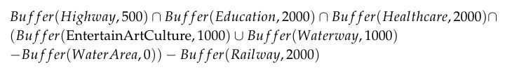
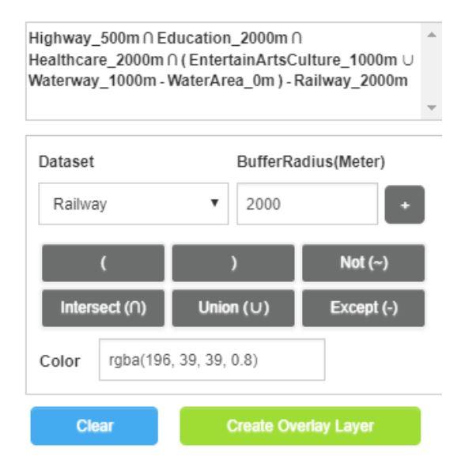
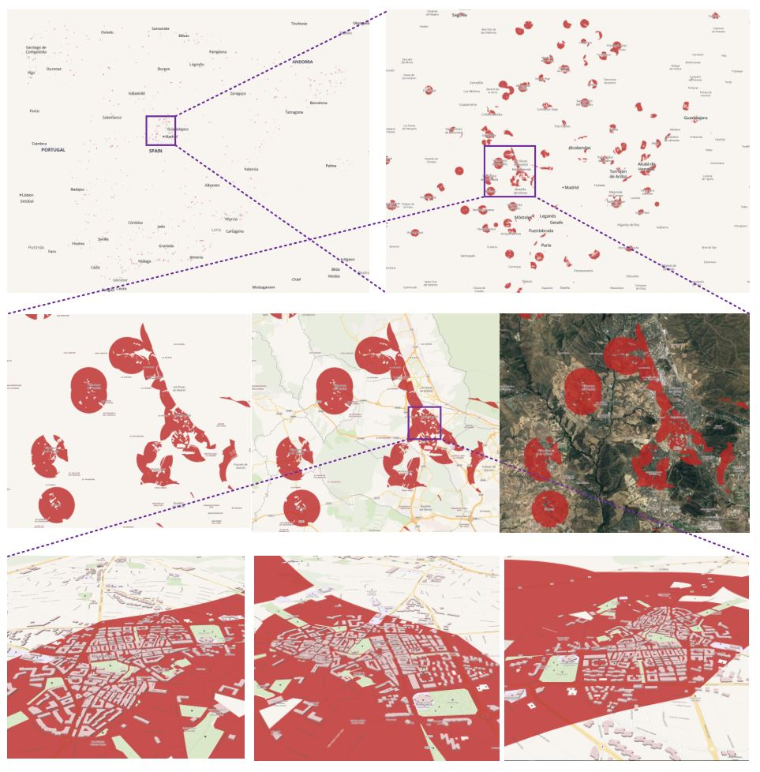

# HiBO (High-performance Buffer and Overlay)
Interactive and Online Buffer and Overlay Analytics of Large Spatial Data. An online demo is provided on the Web. The datasets and hardware environment of the DEMO are shown as follows. Experiments on an SMP server with 32 cores/64 threads verify that our approach is capable of handling datasets with ten-million-scale records.

## [Online Demo](http://www.higis.org.cn:8080/hibo/) 

Chrome is Recommended for the Demo.

***Tab1. Datasets of Spain from [OpenStreetMap](https://download.geofabrik.de/europe/spain-latest.osm.pbf)*** ([Classification standard](https://wiki.openstreetmap.org/wiki/Map_Features))

| Name                                  | Type       | Records   | Size                |
| ------------------------------------- | ---------- | --------- | ------------------- |
| Amenity_Education                     | Point      | 6,994     | 6,994 Points        |
| Amenity_Entertainment, Arts & Culture | Point      | 6,928     | 6,928 Points        |
| Amenity_Financial                     | Point      | 13,040    | 13,040 Points       |
| Amenity_Healthcare                    | Point      | 14,757    | 14,757 Points       |
| Amenity_Sustenance                    | Point      | 89,282    | 89,282 Points       |
| Amenity_Transportation                | Point      | 3,114     | 3,114 Points        |
| Shop                                  | Point      | 82,192    | 82,192 Points       |
| Religion                              | Point      | 6,219     | 6,219 Points        |
| Historic                              | Point      | 14,974    | 14,974 Points       |
| Leisure                               | Point      | 8,334     | 8,334 Points        |
| Tourism                               | Point      | 36,462    | 36,462 Points       |
| Places                                | Point      | 582,464   | 582,464 Points      |
| Public_Transport                      | Point      | 45,478    | 45,478 Points       |
| Railway                               | Linestring | 97,675    | 309,716 Segments    |
| Highway                               | Linestring | 3,132,496 | 42,497,196 Segments |
| Waterway                              | Linestring | 33,214    | 4,254,732 Segments  |
| Natural_Beach                         | Point      | 148       | 148 Points          |
| Natural_Cave                          | Point      | 3,237     | 3,237 Points        |
| Natural_Cliff                         | Point      | 155       | 155 Points          |
| Natural_Peak                          | Point      | 28,106    | 28,106 Points       |
| Natural_Spring                        | Point      | 4,780     | 4,780 Points        |
| Natural_Tree                          | Point      | 533,856   | 533,856 Points      |
| Natural_Volcano                       | Point      | 13        | 13 Points           |
| Water_Area                            | Polygon    | 60,319    | 2,044,622 Edges     |
| Pois_Area                             | Polygon    | 279,010   | 2,462,611 Edges     |
| Pofw_Area                             | Polygon    | 23,337    | 265,523 Edges       |
| Natural_Area                          | Polygon    | 4,034     | 114184 Edges        |
| Places_Area                           | Polygon    | 4,133     | 273,679 Edges       |
| Landuse_Area                          | Polygon    | 459,946   | 18,528,176 Edges    |
| Buildings_Area                        | Polygon    | 2,039,096 | 14,829,921 Edges    |

***Tab2.  Demo Environment***

| Item             | Description                                      |
| ---------------- | ------------------------------------------------ |
| CPU              | 4core*2, Intel(R) Xeon(R) CPU E5-2680 v3@2.50GHz |
| Memory           | 32 GB                                            |
| Operating System | Centos7                                          |

## Scenario

We have designed a housing site selection scenario to show the effect of the demonstration. Suppose that a new immigrant in Spain wants to choose a place to live which meets the following conditions: 1) convenient to traffic (within 500m from Highways); 2) convenient for children education (within 200m from Education amenities); 3) convenient to the medical care (within 2000m from Healthcare amenities); 4) near to leisure places (within 1000m from Entertainment, Arts & Culture amenities or Waterways but not in Water Area); 5) quiet (at least 300m away from Railways). The conditions can be translated into the following expression. Enter the expression in HiBO and click the Create-Overlay-Layer button (Fig 1), then the result layer will be added to the map in real time. Fig 2 shows the analysis results, in which the red areas are the recommended housing places for the immigrant. 

*Fig1. Input of the housing site selection in Spain*

*Fig2. Analysis result of the housing site selection in Spain*

## Citation

Ma M, Wu Y, Luo W, et al. HiBuffer: Buffer Analysis of 10-Million-Scale Spatial Data in Real Time[J]. ISPRS International Journal of Geo-Information. 2018; 7(12):467.

Ma M, Wu Y, et al. Interactive and Online Buffer-Overlay Analytics of Large-Scale Spatial Data[J]. International Journal of Geo-Information, 2019, 8(1):21.

## Contact:

Mengyu Ma@ National University of Defense Technology

Email: mamengyu10@nudt.edu.cn

Tel:+8615507487344
